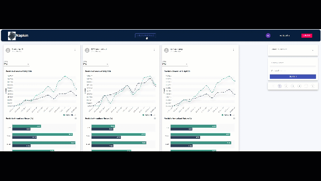

# Napkin - The back of the Napkin Portfolio/Asset Management Tool

# Overview

Napkin is a social media MERN application that allows users to create, manage and interact with various user investment portfolios. The application allows users to analyze, compare, comment and gain insights into a portfolio’s historical risk/return profile by examining various sectors, holdings, and statistical performance and risk metrics against market benchmarks.

Technologies used include MERN (MongoDB, Express.js, React, Node.js) stack, Redux, Webpack, Materail UI, CSS3, HTML5, Recharts and the third-party data from Financial Modeling Prep API. 

the project is currently hosted at https://portfoliobuildertool.herokuapp.com/

# Architecture and Technologies
* JavaScript, the project's front and backend programing language.
* React, a JavaScript library used to assist with efficient management of rapidly changing data and maintaining a single-page web application structure.
* Redux, a JavaScript library used in coordination with React to create a centralized store for organizing and accessing data.
* Node.js, a runtime environment used to execute JavaScript for server-side scripting.
* Express.js, a web application framework, used with Node.js, to provide server-side structure for querying and retrieval of API data.
* MongoDB, a document-oriented (NoSQL) database system used for storage and management of information.
* Webpack, a JavaScript bundler to assist with development and production builds.
* Materaial UI, CSS3 and HTML5, used to manage the presentation and styling of the project.
* Apex Charts, a modern JavaScript charting library that helps developers to create beautiful and interactive visualizations in a React based project.
* Financial Modeling Prep, a third-party finance API used to query and receive real-time stock prices.
* __Heroku__, a cloud hosting platform.

# Functionality
* Comprehensive registration/authentication behavior for management of user sessions, and keeping track of user information (e.g. user portfolios, user comments, trades association and etc).
* Error handling for input fields to prevent invalid entries along with appropriate error messages (e.g. prevents users from signing in with incorrect credentials, stops a user from registering an account under a previously used email address, prevent purchase of a stocks that cost more than a user's available cash, etc.).
* Separate Portfolio and Transaction pages. Portfolio page displays an aggregated list of all stocks a user has purchased, and lists in alphabetical order based on stock ticker. If a stock was purchased in two separate transactions then the transactions are grouped together. Transaction page displays a list of each individual trade in reverse-chronological order.
* Color indicators for the pricing information on the Portfolio page to indicate if a stock's value has increased (green) or decreased (red) in price between the most recent opening and closing values.
* An interactive stock chart, with hover effects, to allow users to review a selected stock's history before completing a purchase.
* A polished, intuitive, responsive user interface/experience.
* Users have the ability to create, update, like, comment on portfolios.  
# Known Issues
* The application may occasionaly not load due to the data constraints of the Financial Modeling Prep API
* only monthly data is availble due to API request per minute availbility
# Future Updates
* ability to stress test a user portfolio with various hypothetical economic scenarios
* a portfolio ranking of all portfolios created in the app to see which portfolio ranks the best due to a risk/resturn reward profile.

 